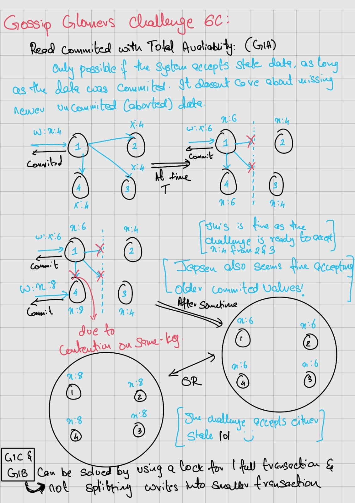

## Overview : 
This repo holds my solutions to the gossip glomers Challenges that has a series of challenges built using `maelstrom` sdk (go and rust). These are a bunch of introductory distributed system challenges that I think give a good first look into dist sys. I personally found them not so challenging.\

Link to these challenges (I hope they never take these down) : [Gossip Glomer Challenges](https://fly.io/dist-sys/)

If for any reason these chalenged were to be taken off of the internet, I have the challenged copied to the `readme.md` in each of the challenged folders, and if they were ever to take down the `maelstrom` binary, I have a version of the binary in this folder as well. 

If they were to take down the maelstrom go SKD, guess what? I have a copy of that in here too xD. *All the test for each of the challenge are part of readme.md in each challenge folder*

## Notes on Challenges : 

### Challenge-1 Echo:

This is a rather simple challenge of just echoing back all the messaged recived by a given node. This challenge only exists to get you used to the maelstrom SDK and runner. I wrote this solution in Rust, back when there was not great support for rust maelstrom SKD.
I figured it was making these challenges much harder not in the way these challenges intended, hence I moved to Golang from the next challenge.

### Challenge-2 Unqiue ID Generation: 

Keep the random generating value state space large enough and ye shall pass. Just depending on the probablity of same unique IDs to be low. They haven't asked for any growing pattern so why bother, right?

### Challenge-3abcd Broadcast single, multi, fault tolerant, efficient part-1:

All of these could be achieved in a single soluion, I wrote a rather straight forward solution and it work well.

### Challenge-3e Broadcast multi, fault tolerant, efficient part-2:

To make our latencies better, i started using a buffer in between to make them happen.

### Challenge-4 Grow only counter:

Used a global KV to solve this challenge.

### Challenge-5a Single Node Kafka:

Here I used a KV service, this is just a step one to harder challenges using KV. Also commit messages can be stored only in local

### Challenge-5b Muti Node Kafka: 

Here we need to start thinking of recency and guarentees and race conditions. 

### Challenge-5c Efficient Multi Node Kafka:

Here we need to start thinking as to which data recides in whic KV!

### Challenge-6a Single node KV:

A single node KV, try and not use a KV provided by maelstrom. A local KV makes this challenge its worth.

### Challenge-6b Multi Node KV Read Uncommitted:

extension of challenge 6a, but now we move a multi node replicated kV store with a rather weak gaurentee. `Read Uncommitted` is what is asked of us. In this gaurentee almost anything is allowed. They also want you to check against partition for total availability.

### Challenge-6c Multi Node KV Read Committed:

This is an extension of challenge 6b. Now they still want a multi node KV store, but a `read committed` transactional gaurentee is required. Despite only being a small addition, this makes the challenge hard and worthy of a final `boss` challenge (xD)

The solution is rather simple, the key is [BEWARE BEFORE OPENING, its worth working out on your own]: 

  
Spoiler warning

  Jespen asks for total availability, this is only possible if stale reads are allowed. In this challenge Jespen accepts all stale read. To handle intermediated reads make sure to get one lock per transaction and not break up the transaction.
  
  
  

    
--- 
### Notes on topics : 

#### Sequential consistency 
Sequential consistency is a strong safety property for concurrent systems. Informally, sequential consistency implies that operations appear to take place in some total order, and that that order is consistent with the order of operations on each individual process.

> Sequential consistency cannot provide gaurentees of ordering across processes

#### Read Uncommitted 

Any value for reads are accepted, very weak gaurentee.

#### Read committed

Any commited value for reads are accepted, slightly stronger than read Uncommitted.

> Both read committed and Uncommitted dont mention anything about recency gaurenteed, make use of that property for solving challenges
